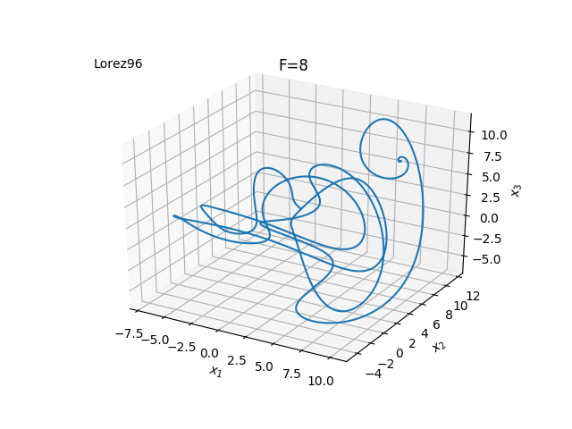
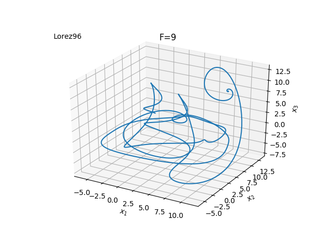

# Lorenz96 model implementation

## Overview
I implemented Lorenz96 model with python.

## Image

## Requirement
This module needs `matplotlib` and `numpy`.
So, before you implement this environment, you have to install matplotlib and numpy.
You can install `matplotlib` and `numpy` by following below command.

`pip install requirements.txt`

## Usage
For implementation of this, you can choose whether to save image.
if you want to save image, you can do it by following below.

`python main.py -s`

## Author
GitHub account
[komi1230](https://github.com/komi1230)

Twitter acoount
[@komi3__](https://twitter.com/komi3__)

Follow me !
