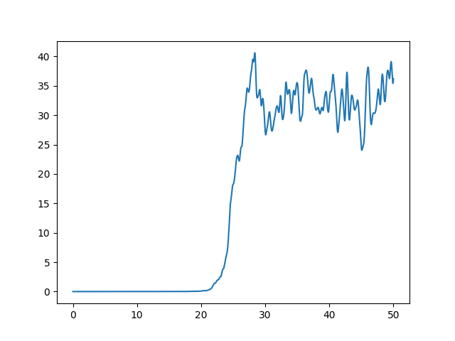
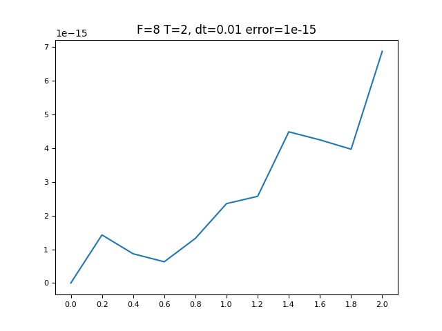

# Lorenz96 model implementation

## Overview
I implemented Lorenz96 model with python.
And, I implemented some types of data assimilation systems, for example Kalman filter, Ensemble Kalman Filter and 3 dimentional variational method.
Later I will implement 4 dimentional variational method.

## Model Image

## Evaluate 

## Requirement
This module needs `matplotlib` and `numpy`.
So, before you implement this environment, you have to install matplotlib and numpy.
You can install `matplotlib` and `numpy` by following below command.

`pip install requirements.txt`

## Usage
### Plot
For implementation of this, you can choose whether to save image.
if you want to save image, you can do it by following below.

`python plot.py -s`

### Make True Value / Observation Data
First, you have to make true value.
Follow below.

`cd make_data`

change directory. Next, implement.

`python make_true_value.py`

To get observation data, next command you have to implement is below.

`python noise.py`

## Author
GitHub account
[komi1230](https://github.com/komi1230)

Twitter acoount
[@komi3__](https://twitter.com/komi3__)

Follow me !
